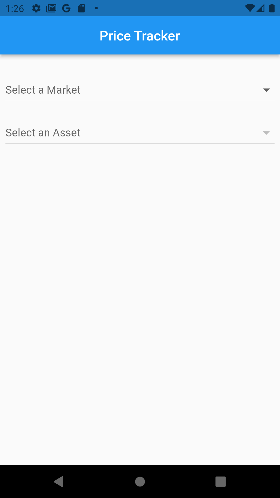
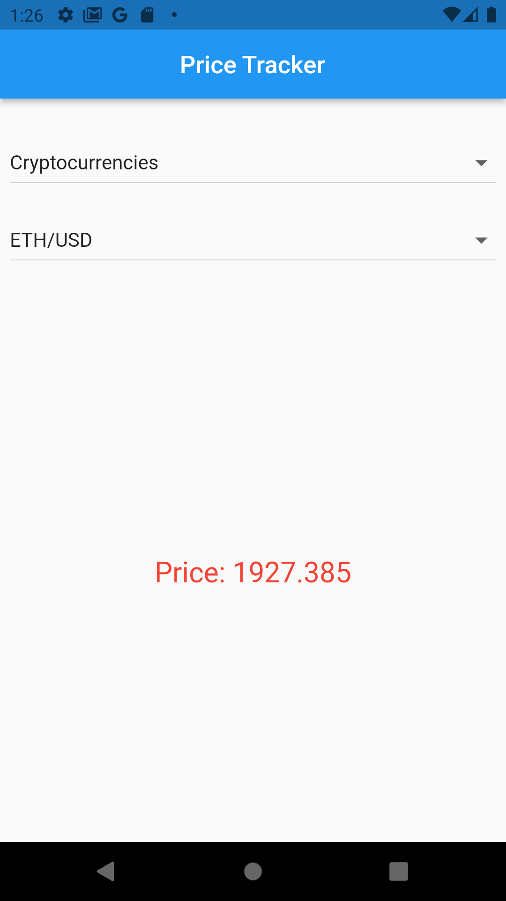
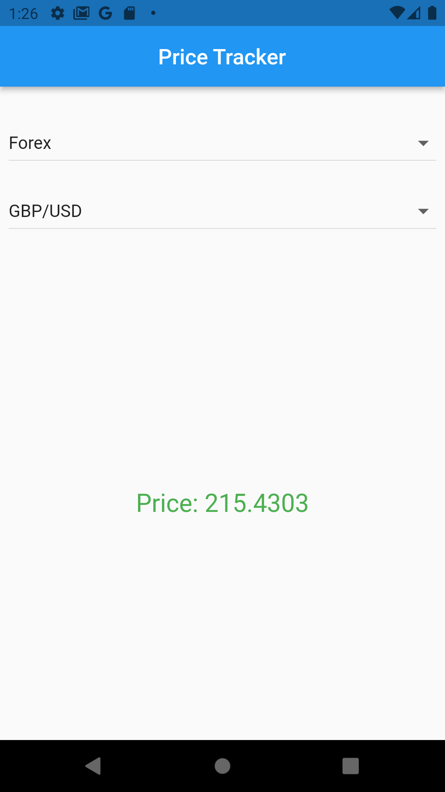

# Price-Traker-Flutter
A sample flutter application shows an example about the usage of streams with BLoC state-management, communicates with a WebSocket API which supports a price tracking events and the market symbols and assets.

#### Compatible with **Android, IOS, Web, Windows** platforms.

### Features 🚀
- Get the current symbols in the market defined by the WebSocket API.
- When select the market and the included symbol the app will start track the price.
- Price will change like the screenshots below, when price goes down its color will be **Red**, goes up -> **Green**, still same price -> **Grey**.

## Functional Description
- Designed in **Clean Architecture Pattern**.
- The used state-management is [BLoC](https://pub.dev/packages/flutter_bloc).
- Handle streams using [web_socket_channel](https://pub.dev/packages/web_socket_channel).
- [get_it](https://pub.dev/packages/get_it) is used for the dependency injection.

## Screenshots 🎉
Home  |  Price Goes Down  |  Price Goes Up
:-------------------------:|:-------------------------:|:-------------------------:
  |    |  

## Apply With Your Project
- Add your host and API url to *lib\core\constants\api_config.dart* file. 
- Your json data about **Active Symbols**(Used to retrieve the current symbols) that retrieved from the API the single object should contains:
```
{
  "active_symbols": [
    {
      "display_name": "AUD Basket",
      "display_order": 23,
      "market": "synthetic_index",
      "market_display_name": "Derived",
      "spot": 920.717,
      "symbol": "WLDAUD",
      "symbol_type": "forex_basket"
    }
  ]
}
```
- Your json data about **Tick**(Used to track the symbol price) that retrieved from the API the single object should contains:
```
{
  "tick": {
    "id": "417a56af-c9f1-cd25-654d-3c77e9025d18",
    "quote": 215.4303,
    "symbol": "R_50"
  }
}
```
- Or you can customize the data retrieved by editing the entities, models, and following files:
* *lib\features\tracker\data\datasources\remote\symbols_remote_datasource.dart*
* *lib\features\tracker\data\datasources\remote\ticks_remote_datasource.dart*


